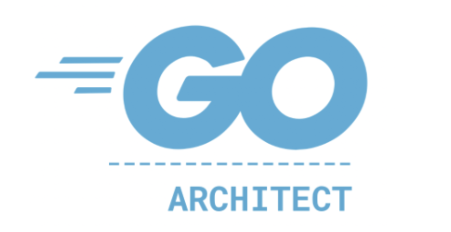
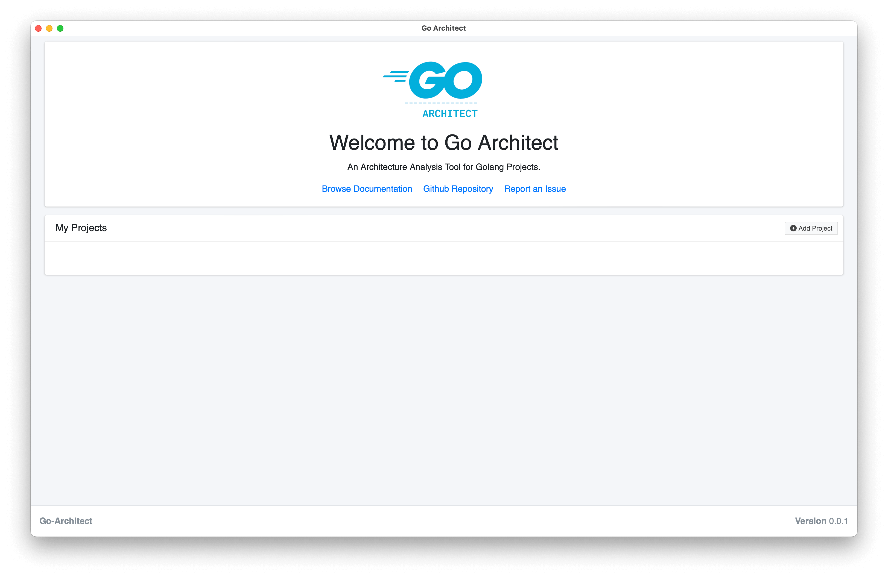
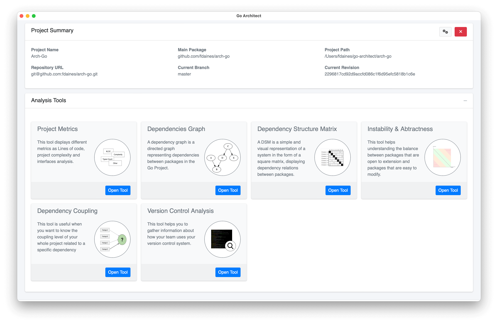

# Go-Architect
<div align="center">

</div>

---
Go-Architect is a Software Architecture Analysis Tool for projects written in Go language. 
You can use this tool to analyze the design of your artifacts in order to ease decisions related to refactoring your code, 
fixing issues or evolving the artifact's features.



## Features
- Analyze projects in Go language, collecting metrics and interpreting architectural information.
- Graphic visualization to facilitate the understanding of architectural decisions.
- Stores historical data to compare the evolution of your architecture.



## Installation

### Requirements
- Go v1.19 (https://go.dev/doc/install)
- GoCyclo (https://pkg.go.dev/github.com/fzipp/gocyclo) for Cyclomatic complexity metrics
- GoCognit (https://pkg.go.dev/github.com/uudashr/gocognit) for Cognitive complexity metrics

### Installation Process
At the moment, installing Go-Architect can only be done manually, by executing the following commands:
```bash
git clone https://github.com/go-architect/go-architect
cd go-architect
make install
```
